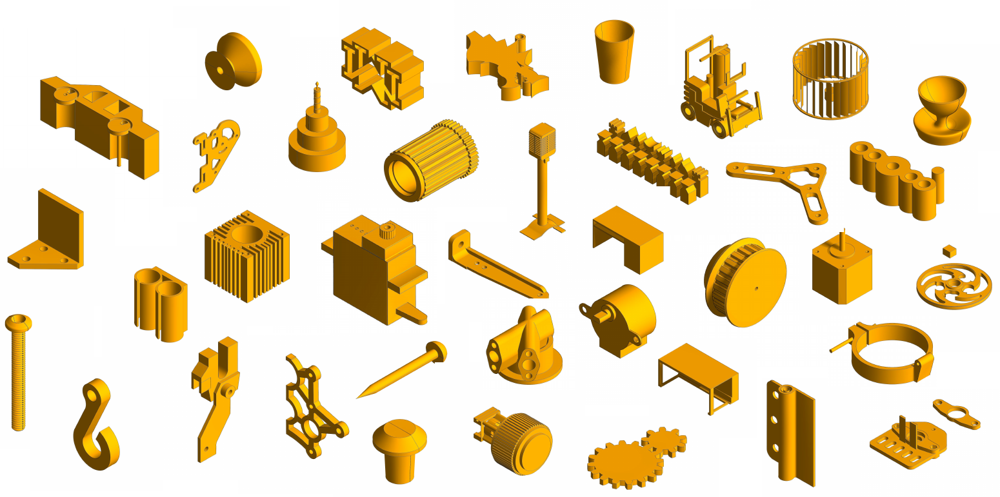
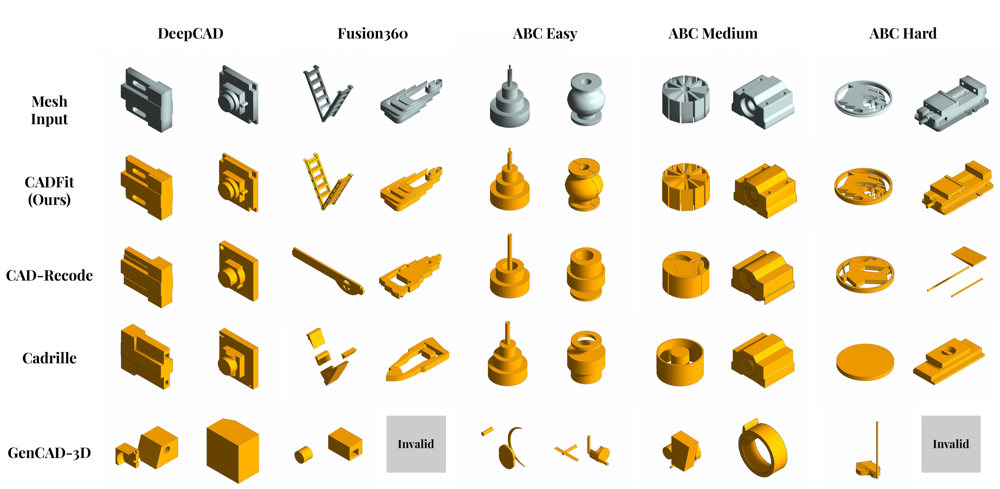
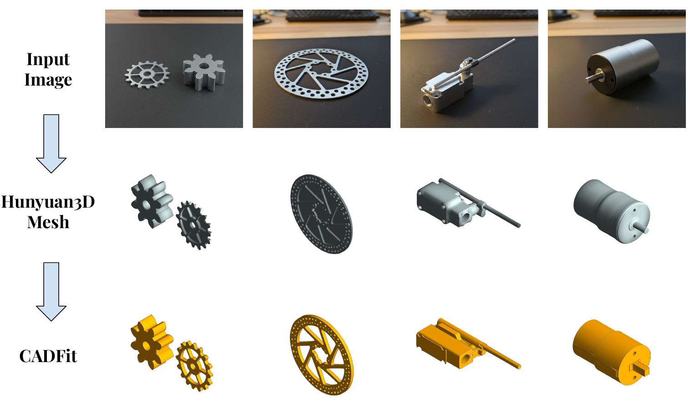
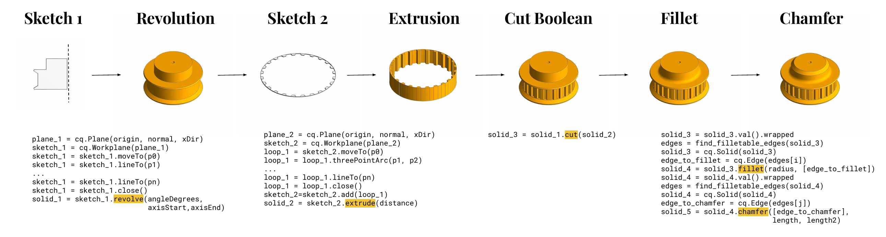

<div align="center">

## CADFit: Precise Mesh-to-CAD Program Generation with Hybrid Optimization

> Ghadi Nehme<sup>1</sup>, Eamon Whalen<sup>2</sup>, Faez Ahmed<sup>1</sup> <br>
> <sup>1</sup>Massachusetts Institute of Technology  
> <sup>2</sup>Siemens Digital Industries Software

[](https://arxiv.org/abs/2605.01171) [](https://ghadinehme.github.io/cadfit.github.io/)

</div>

<div align="center">
  
</div>


---

## Introduction

**CADFit** is a hybrid optimization-based framework that recovers complex, editable CAD construction sequences from watertight meshes by incrementally fitting and validating parametric operations using geometric feedback. Rather than predicting programs in a single forward pass, CADFit formulates reconstruction as an explicit **IoU-driven optimization over executable CAD programs**, supporting a rich operator set (extrusions, revolutions, fillets, chamfers) composed using Boolean union and cut.

---

## Key Features

- **Rich operator set.** `Extrude`, `Revolve`, `Fillet`, `Chamfer`, `Union`, `Cut` — far beyond sketch-and-extrude pipelines.
- **IoU-driven optimization, kernel-validated.** Every candidate is built through CadQuery; the optimizer maximizes the same volumetric IoU it reports. Invalid Ratio = **0** on every benchmark slice.
- **Compact construction sequences.** Backward marginal pruning produces shorter, cleaner programs than the originals, giving higher-quality supervision for downstream learning models.
- **Iterative residual refinement.** Positive and negative residuals are reconstructed with the same pipeline and composed with `Union` / `Cut`, until residual volume falls below tolerance.
- **Modality-agnostic.** The same algorithm handles meshes from STL exports, point clouds, or images-to-3D models (we use Hunyuan3D) — no retraining.

---

## Qualitative Mesh-to-CAD Results

<div align="center">
  
</div>

DeepCAD, Fusion360, and ABC (easy/medium/hard). CADFit produces a valid, editable CAD program on every input where baselines either output `Invalid` or visibly diverge from the target geometry.

---

## Multimodal Image-to-CAD

CADFit is agnostic to where the mesh comes from. Pairing it with a pretrained image-to-3D model — we use [Hunyuan3D](https://github.com/Tencent-Hunyuan/Hunyuan3D-2) — and standard post-processing (watertight enforcement, Taubin smoothing, mesh decimation) gives a fully end-to-end **image-to-CAD** pipeline.

<div align="center">
  
</div>

---

## Example CadQuery Output

Every CADFit run emits an executable Python script that reproduces the solid in CadQuery:

<div align="center">
  
</div>

---

## Quick Start

```bash
conda create -n cadfit-env python=3.10 && conda activate cadfit-env
pip install -r requirements.txt
```

Reconstruct every STL in a folder:

```bash
python run_pipeline.py <input_folder>
```

Outputs land in `<input>_runs/<stl_id>/` (override with `--output-folder OUT`):

```
<input>_runs/<stl_id>/
├── best_greedy_parallel_iterative.stl   # final reconstruction
├── best_greedy_parallel_iterative.py    # equivalent CadQuery program
└── final_iou.json                       # { final_iou, duration, ... }
```

Common flags:

| flag | effect |
|---|---|
| `--max-iterations N` | residual cut/union refinement passes (default `1`) |
| `--skip-existing` | resume — skip STLs whose `final_iou.json` exists |
| `--fillet-chamfer` | enable per-edge fillet/chamfer pass (off by default) |
| `--limit N`, `--start-from FILE.stl` | narrow the input list |

For best throughput on a multi-core box, raise the inner worker pool:

```bash
CADFIT_INNER_WORKERS=25 python run_pipeline.py abc_hard
```

Call from Python directly:

```python
from run_pipeline import process_single_stl
process_single_stl("abc_hard/00013080.stl",
                    folder_name="abc_hard_runs",
                    max_iterations=1)
```

---

## Citation

If you find our work helpful, please consider citing:

```bibtex
@article{nehme2026cadfit,
  title={CADFit: Precise Mesh-to-CAD Program Generation with Hybrid Optimization},
  author={Nehme, Ghadi and Whalen, Eamon and Ahmed, Faez},
  journal={arXiv preprint arXiv:2605.01171},
  year={2026}
}
```

---

## Contact

For questions, issues, or collaboration, please contact: `ghadi@mit.edu`

---
